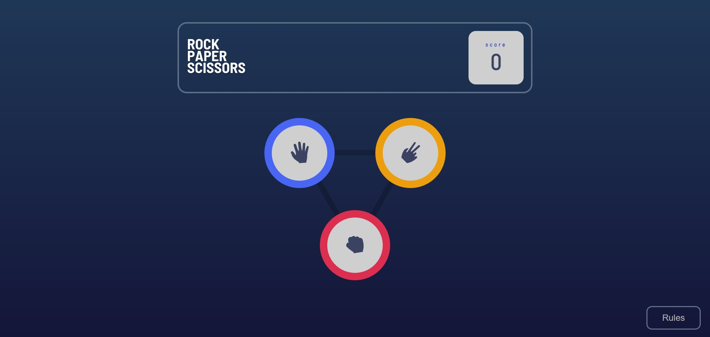
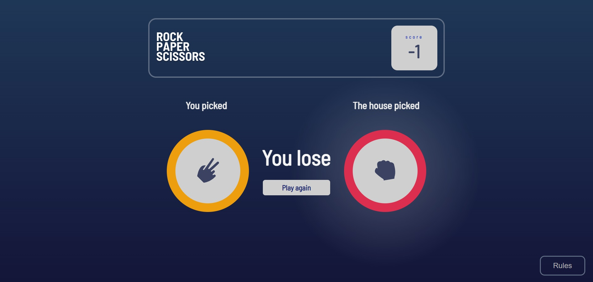
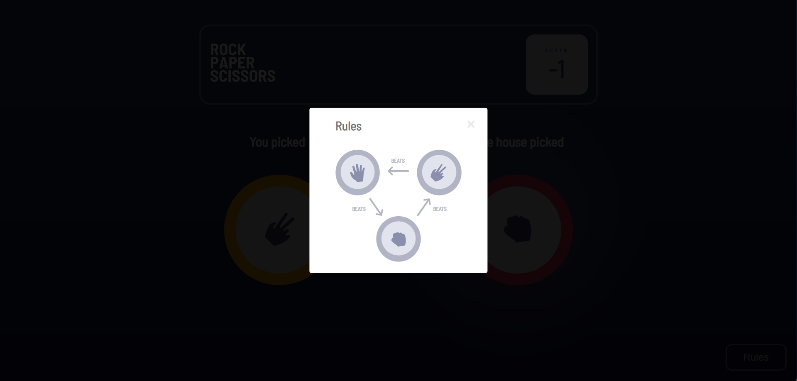

# Frontend Mentor - Rock, Paper, Scissors solution

This is a solution to the [Rock, Paper, Scissors challenge on Frontend Mentor](https://www.frontendmentor.io/challenges/rock-paper-scissors-game-pTgwgvgH). Frontend Mentor challenges help you improve your coding skills by building realistic projects. 

## Table of contents

- [Overview](#overview)
  - [The challenge](#the-challenge)
  - [Screenshot](#screenshot)
  - [Links](#links)
- [My process](#my-process)
  - [Built with](#built-with)
  - [What I learned](#what-i-learned)
- [Author](#author)

## Overview

### The challenge

Users should be able to:

- View the optimal layout for the game depending on their device's screen size
- Play Rock, Paper, Scissors against the computer
- Maintain the state of the score after refreshing the browser 

### Screenshot

### Links

- Live Site URL: (https://gustavo-sperling-rps-game.netlify.app/)

## My process

### Built with

- **HTML:** For structuring the web page and its elements.
- **CSS:** For styling the HTML elements, including layout, colors, fonts, etc.
- **JavaScript:** For implementing the game logic, handling user interactions, and dynamic behavior.
- **Local Storage API:** Used in JavaScript to store and retrieve data (such as the score) locally on the user's device.
- **SVG (Scalable Vector Graphics):** For creating and displaying vector graphics, such as the icons for rock, paper, and scissors.
- **Media Queries:** In CSS, for creating responsive designs that adapt to different screen sizes, such as those of smartphones.

### What I learned

Throughout the development of this project, I gained valuable experience and knowledge in several key areas of web development. Firstly, I deepened my understanding of front-end technologies such as HTML, CSS, and JavaScript, which are essential for creating interactive and visually appealing web applications. In particular, I became proficient in using JavaScript to implement game logic, handle user interactions, and dynamically update the DOM based on various events. This involved tasks like generating random computer choices, comparing them with the player's selection, and updating the score accordingly.

Additionally, I learned how to leverage CSS techniques like media queries to create responsive designs that adapt seamlessly to different screen sizes, ensuring optimal user experience across various devices, including smartphones and tablets. I also gained familiarity with using the Local Storage API in JavaScript to persistently store and retrieve data, such as the player's score, ensuring that the score persists even after page reloads or browser sessions.

Overall, this project provided me with practical hands-on experience in building a web-based game from scratch, honing my skills in front-end development, JavaScript programming, SVG graphics, responsive design, and data persistence techniques. 

## Author

Gustavo Sperling

